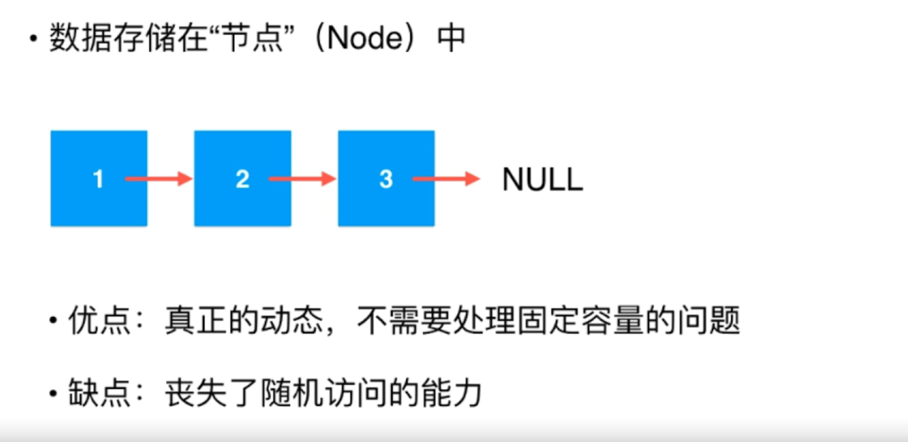
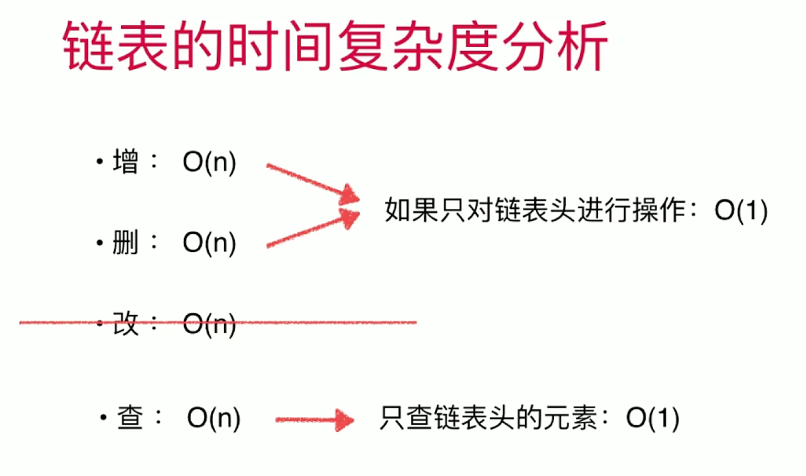
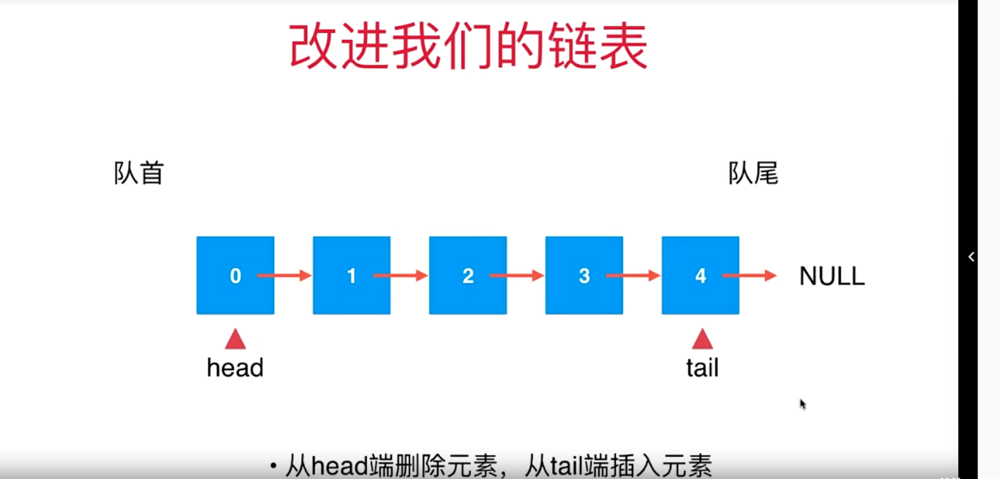
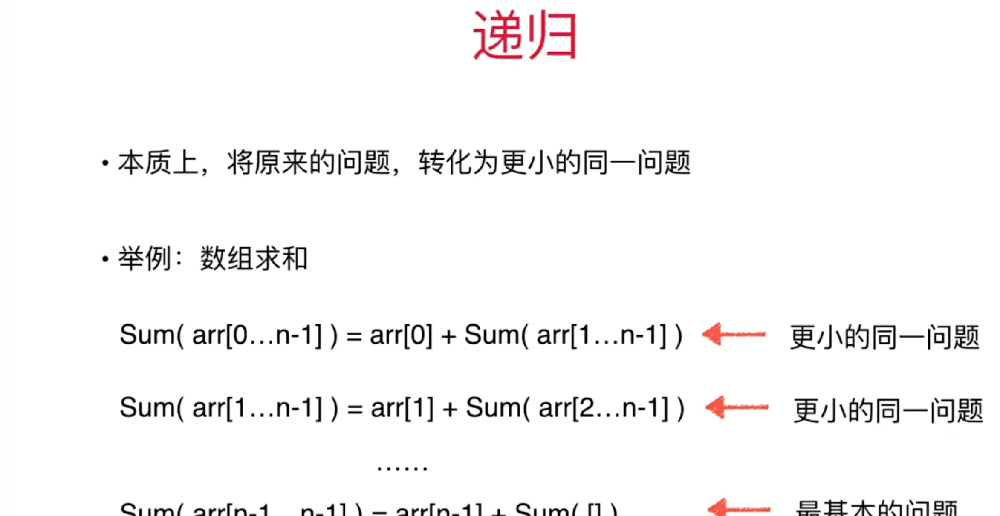
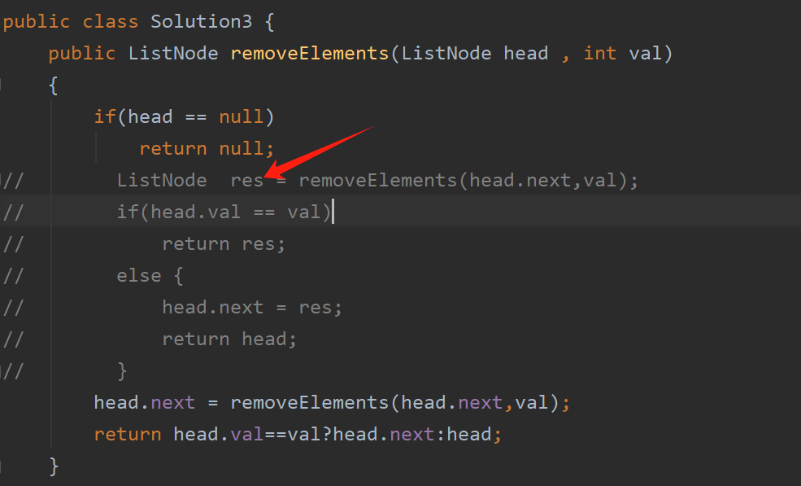
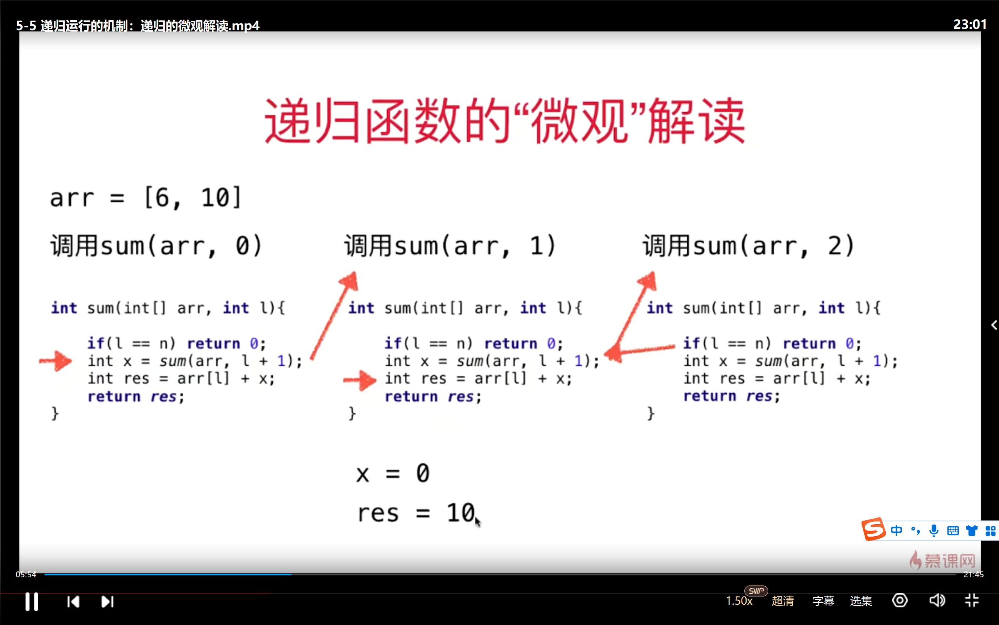

# 一,数组

1.优势：

快速查询------->所以最好索引有意义

# 二，复杂度分析

1.简单的复杂度分析

2.均摊复杂度  

​      问题：复杂度震荡    

# 三，栈

FILO

# 四，队列

### 二.链表

真正的动态数据结构，最简单的动态数据结构

数据存储在节点（Node）

适合对链表头操作   ----栈

可以做队列

### 三.链表与递归

宏观:

化为更小问题

res代表更小的链表

分为最前面元素和后面的全部链表

 

### 四.二分搜索树

存储的元素必须有可比较性（局限性）   -----加快搜索

前序遍历   节点 左 右

中序变量  左 节点 右